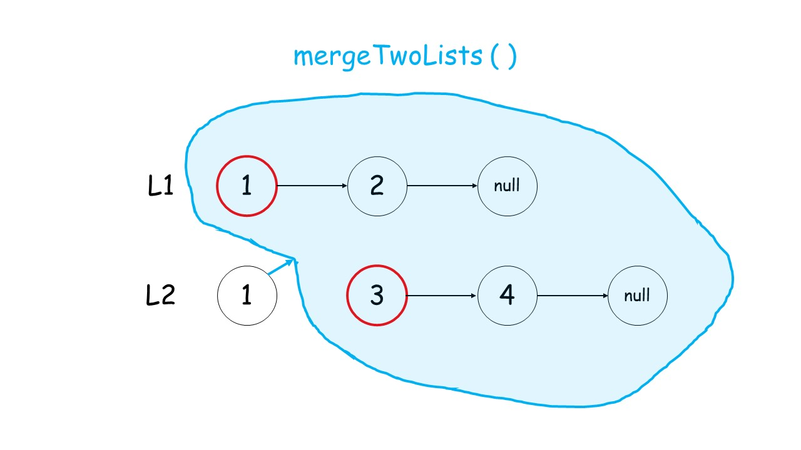
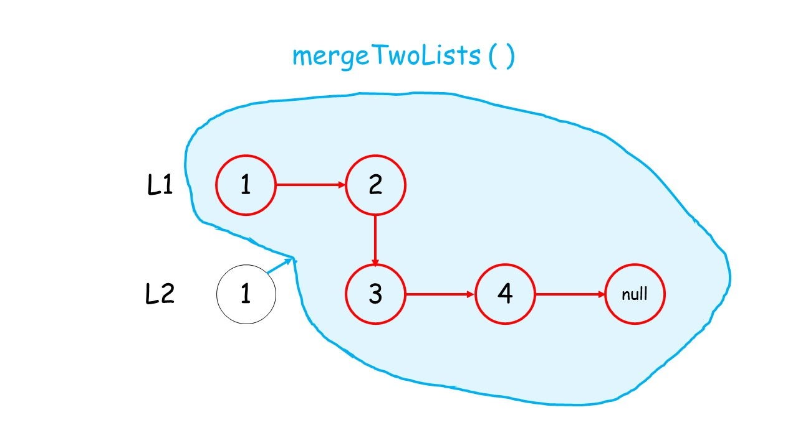

# 合并两个有序链表

## 题目

将两个升序链表合并为一个新的 **升序** 链表并返回。新链表是通过拼接给定的两个链表的所有节点组成的。

**示例 1：**


```text
输入：l1 = [1,2,4], l2 = [1,3,4]
输出：[1,1,2,3,4,4]
```

**示例 2：**

```text
输入：l1 = [], l2 = []
输出：[]
```

**示例 3：**

```text
输入：l1 = [], l2 = [0]
输出：[0]
```

**提示：**

- 两个链表的节点数目范围是 `[0, 50]`
- `-100 <= Node.val <= 100`
- `l1` 和 `l2` 均按 **非递减顺序** 排列

## 题解

什么是递归呢？**函数在运行时调用自己**，这个函数就叫递归函数，调用的过程叫做递归。  
比如定义函数 `f(x)=x+f(x−1)`：

- python

```python
def f(x):
    return x + f(x-1)
```

如果代入 f(2)f(2)f(2)：

- 返回 2+f(1)2+f(1)2+f(1)；
- 调用 f(1)f(1)f(1)；
- 返回 1+f(0)1+f(0)1+f(0)；
- 调用 f(0)f(0)f(0)；
- 返回 0+f(−1)0+f(-1)0+f(−1)
- ......

这时程序会无休止地运行下去，直到崩溃。  
如果我们加一个判断语句 `x > 0`：

- python

```python
def f(x):
    if x > 0:
        return x + f(x-1)
    else:  # f(0) = 0
        return 0
```

这次计算 `f(2)=2+f(1)=2+1+f(0)=2+1+0=3`。我们从中总结两个规律：

- 递归函数必须要有**终止条件**，否则会出错；
- 递归函数先不断调用自身，直到遇到终止条件后进行回溯，最终返回答案。

根据以上规律考虑本题目：

- 终止条件：当两个链表都为空时，表示我们对链表已合并完成。
- 如何递归：我们判断 `l1` 和 `l2` 头结点哪个更小，然后较小结点的 `next` 指针指向**其余结点的合并结果。（调用递归）**








kotlin

```kotlin
fun main() {
    val a=ListNode(5,ListNode(6,ListNode(7,ListNode(8))))
    val b=ListNode(3,ListNode(7,ListNode(8,ListNode(10,ListNode(11)))))
    val c=Solution().mergeTwoLists(a, b)
    println(c)
}

data class ListNode(var value: Int, var next: ListNode? = null)

class Solution {
    fun mergeTwoLists(list1: ListNode?, list2: ListNode?): ListNode? {
        if (list1 == null) return list2
        if (list2 == null) return list1
        val result = if (list1.value < list2.value) list1 else list2
        result.next = mergeTwoLists(result.next, if (list1.value >= list2.value) list1 else list2)
        return result
    }
}
```
