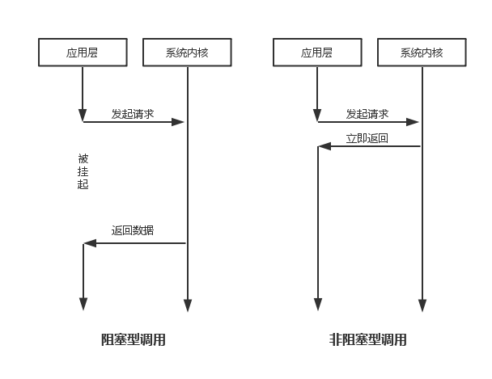
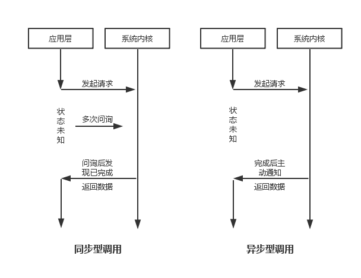

# 阻塞非阻塞 同步异步

## 阻塞非阻塞

从简单的开始，我们以经典的读取文件的模型举例。（对操作系统而言，所有的输入输出设备都被抽象成文件。）

在发起读取文件的请求时，应用层会调用系统内核的 I/O 接口。

如果应用层调用的是阻塞型 I/O，那么在调用之后，应用层即刻被挂起，一直出于等待数据返回的状态，直到系统内核从磁盘读取完数据并返回给应用层，应用层才用获得的数据进行接下来的其他操作。

如果应用层调用的是非阻塞 I/O，那么调用后，系统内核会立即返回（虽然还没有文件内容的数据），应用层并不会被挂起，它可以做其他任意它想做的操作。（至于文件内容数据如何返回给应用层，这已经超出了阻塞和非阻塞的辨别范畴。）

这便是（脱离同步和异步来说之后）阻塞和非阻塞的区别。总结来说，是否是阻塞还是非阻塞，关注的是接口调用（发出请求）后等待数据返回时的状态。被挂起无法执行其他操作的则是阻塞型的，可以被立即「抽离」去完成其他「任务」的则是非阻塞型的。

## 同步异步

阻塞和非阻塞解决了应用层等待数据返回时的状态问题，那系统内核获取到的数据到底如何返回给应用层呢？这里不同类型的操作便体现的是同步和异步的区别。

对于同步型的调用，应用层需要自己去向系统内核问询，如果数据还未读取完毕，那此时读取文件的任务还未完成，应用层根据其阻塞和非阻塞的划分，或挂起或去做其他事情（所以同步和异步并不决定其等待数据返回时的状态）；如果数据已经读取完毕，那此时系统内核将数据返回给应用层，应用层即可以用取得的数据做其他相关的事情。

而对于异步型的调用，应用层无需主动向系统内核问询，在系统内核读取完文件数据之后，会主动通知应用层数据已经读取完毕，此时应用层即可以接收系统内核返回过来的数据，再做其他事情。

这便是（脱离阻塞和非阻塞来说之后）同步和异步的区别。也就是说，是否是同步还是异步，关注的是任务完成时消息通知的方式。由调用方盲目主动问询的方式是同步调用，由被调用方主动通知调用方任务已完成的方式是异步调用。

## 场景举例

最后，再来举一个我们日常的例子来加深对这几个概念的理解。

假设小明需要在网上下载一个软件：

如果小明点击下载按钮之后，就一直干瞪着进度条不做其他任何事情直到软件下载完成，这是同步阻塞；

如果小明点击下载按钮之后，就一直干瞪着进度条不做其他任何事情直到软件下载完成，但是软件下载完成其实是会「叮」的一声通知的（但小明依然那样干等着），这是异步阻塞；（不常见）

如果小明点击下载按钮之后，就去做其他事情了，不过他总需要时不时瞄一眼屏幕看软件是不是下载完成了，这是同步非阻塞；

如果小明点击下载按钮之后，就去做其他事情了，软件下载完之后「叮」的一声通知小明，小明再回来继续处理下载完的软件，这是异步非阻塞。

相信看完以上这个案例之后，这几个概念已经能够分辨得很清楚了。

## 总结

总的来说，而阻塞和非阻塞关注的是 **等待任务完成时请求者的状态** ，同步和异步关注的是 **任务完成消息通知的机制** 。

来源：

[Maples7 完全理解同步 / 异步与阻塞 / 非阻塞](https://maples7.com/2016/08/24/understand-sync-async-and-blocking-non-blocking/)
