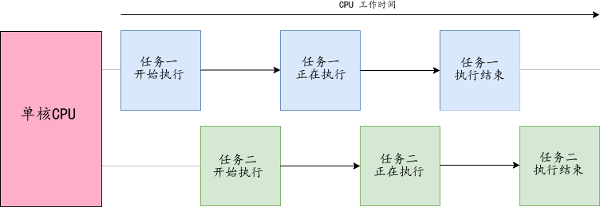

# 并发并行

在学习多线程/进程编程时，我们经常会遇到并发和并行这两个名词，它们看起来是一个概念，都是“多个线程/进程同时执行”的意思，但实际上它们是有区别的，甚至说不是一码事。

很多教材也都解释了并发和并行的区别，例如：

- 并行是指两个或者多个事件在同一时刻发生，而并发是指两个或多个事件在同一时间间隔发生。
- 并行是在不同实体上的多个事件，并发是在同一实体上的多个事件。

不过这种解释非常晦涩难懂，估计只有作者自己才能搞明白。这篇文章，我将站在一个大叔程序员的视角，使用通俗易懂的语言来重新剖析并发和并行的区别，并配上优雅的图片，以加深读者的理解。

## 并发（Concurrency）

早期计算机的 CPU 都是单核的，一个 CPU 在同一时间只能执行一个进程/线程，当系统中有多个进程/线程等待执行时，CPU 只能执行完一个再执行下一个。

为了表述简单，下文我们将不再区分进程和线程，而将它们统一称为“任务”。在不同的场景下，一个任务可能是进程，也可能是线程。

计算机在运行过程中，有很多指令会涉及 I/O 操作，而 I/O 操作又是相当耗时的，速度远远低于 CPU，这导致 CPU 经常处于空闲状态，只能等待 I/O 操作完成后才能继续执行后面的指令。

为了提高 CPU 利用率，减少等待时间，人们提出了一种 CPU 并发工作的理论。

所谓并发，就是通过一种算法将 CPU 资源合理地分配给多个任务，当一个任务执行 I/O 操作时，CPU 可以转而执行其它的任务，等到 I/O 操作完成以后，或者新的任务遇到 I/O 操作时，CPU 再回到原来的任务继续执行。

下图展示了两个任务并发执行的过程：

图1：单核 CPU 执行两个任务

虽然 CPU 在同一时刻只能执行一个任务，但是通过将 CPU 的使用权在恰当的时机分配给不同的任务，使得多个任务在宏观上看起来是一起执行的。CPU 的执行速度极快，多任务切换的时间也极短，用户根本感受不到，所以并发执行看起来才跟真的一样。

操作系统负责将有限的 CPU 资源分配给不同的任务，但是不同操作系统的分配方式不太一样，常见的有：

- 当检测到正在执行的任务进行 I/O 操作时，就将 CPU 资源分配给其它任务。
- 将 CPU 时间平均分配给各个任务，每个任务都可以获得 CPU 的使用权。在给定的时间内，即使任务没有执行完成，也要将 CPU 资源分配给其它任务，该任务需要等待下次分配 CPU 使用权后再继续执行。

将 CPU 资源合理地分配给多个任务共同使用，有效避免了 CPU 被某个任务长期霸占的问题，极大地提升了 CPU 资源利用率。

## 并行（Parallelism）

并发是针对单核 CPU 提出的，而并行则是针对多核 CPU 提出的。和单核 CPU 不同，多核 CPU 真正实现了“同时执行多个任务”。

多核 CPU 内部集成了多个计算核心（Core），每个核心相当于一个简单的 CPU，如果不计较细节，你可以认为给计算机安装了多个独立的 CPU。

多核 CPU 的每个核心都可以独立地执行一个任务，而且多个核心之间不会相互干扰。在不同核心上执行的多个任务，是真正地同时运行，这种状态就叫做并行。

例如，同样是执行两个任务，双核 CPU 的工作状态如下图所示：

图2：双核 CPU 执行两个任务

双核 CPU 执行两个任务时，每个核心各自执行一个任务，和单核 CPU 在两个任务之间不断切换相比，它的执行效率更高。

## 并发+并行

在图2中，执行任务的数量恰好等于 CPU 核心的数量，是一种理想状态。但是在实际场景中，处于运行状态的任务是非常多的，尤其是电脑和手机，开机就几十个任务，而 CPU 往往只有 4 核、8 核或者 16 核，远低于任务的数量，这个时候就会同时存在并发和并行两种情况：所有核心都要并行工作，并且每个核心还要并发工作。

例如一个双核 CPU 要执行四个任务，它的工作状态如下图所示：

每个核心并发执行两个任务，两个核心并行的话就能执行四个任务。当然也可以一个核心执行一个任务，另一个核心并发执行三个任务，这跟操作系统的分配方式，以及每个任务的工作状态有关系。

## 总结

并发针对单核 CPU 而言，它指的是 CPU 交替执行不同任务的能力；并行针对多核 CPU 而言，它指的是多个核心同时执行多个任务的能力。

单核 CPU 只能并发，无法并行；换句话说，并行只可能发生在多核 CPU 中。

在多核 CPU 中，并发和并行一般都会同时存在，它们都是提高 CPU 处理任务能力的重要手段。

原文：[并发和并行的区别（图解）](http://c.biancheng.net/view/9486.html)
