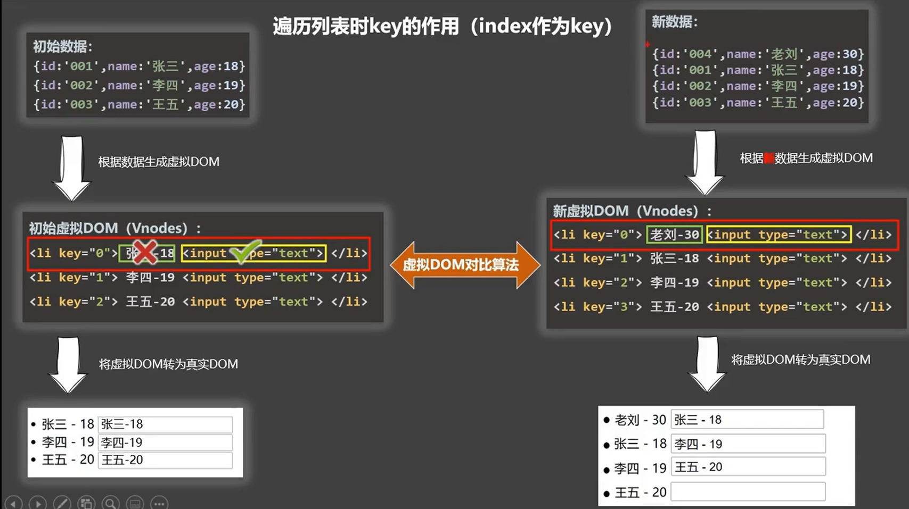
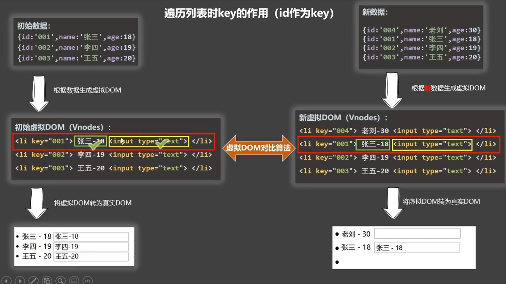

# key的作用与原理

面试题: react、 vue中的key有什么作用?(key的内部原理)

## 1. 虚拟DOM中key的作用

key是虚拟DOM对象的标识，当状态中的数据发生变化时，Vue会根据【新数据】生成【新的虚拟DOM】，随后Vue进行【新虚拟DOM】与【旧虚拟DOM】的差异比较，比较规则如下:

对比规则:

- 旧虚拟DOM中找到了与新虚拟DOM相同的key：
  - 若虚拟DOM中内容没变,直接使用之前的真实DOM!
  - 若虚拟DOM中内容变了，则生成新的真实DOM，随后替换掉页面中之前的真实DOM.
- 旧虚拟DOM中未找到与新虚拟DOM相同的key
  - 创建新的真实DOM,随后渲染到到页面。

## 2. 用index作为key可能会引发的问题

- 若对数据进行:逆序添加、逆序删除等破坏顺序操作：会产生没有必要的真实DOM更新==〉界面效果没问题,但效率低。
- 如果结构中还包含输入类的DOM：会产生错误DOM更新==>界面有问题。

## 3. 开发中如何选择key

- 最好使用每条数据的唯一标识作为key，比如id、手机号、身份证号、学号等唯一值。
- 如果不存在对数据的逆序添加、逆序删除等破坏顺序操作，仅用于渲染列表用于展示，用index做key没问题。
